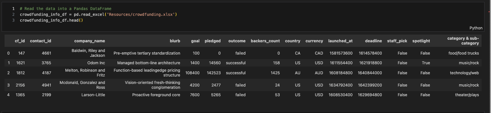
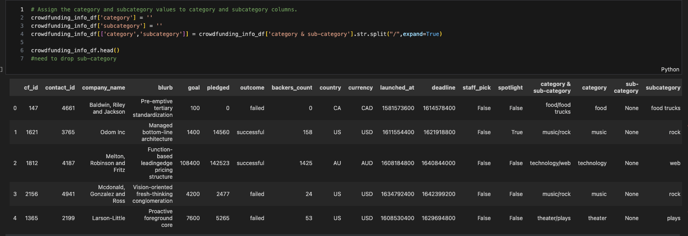
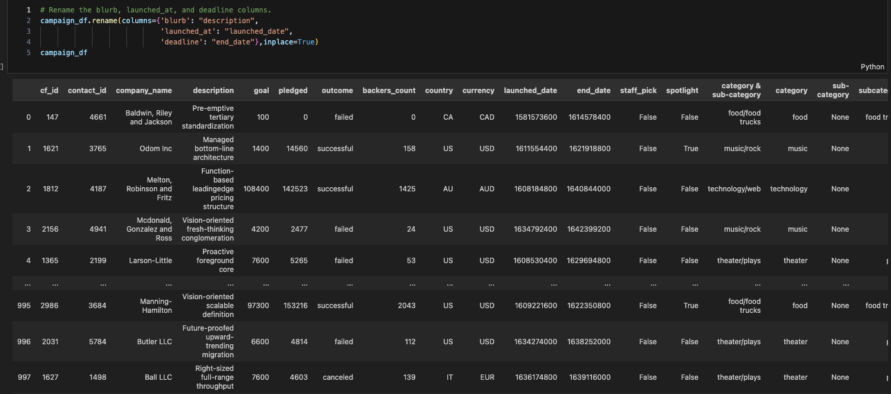
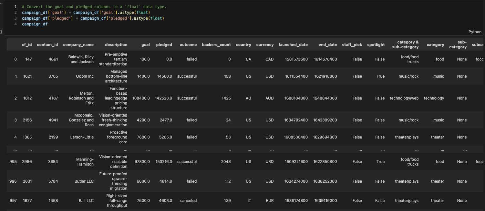
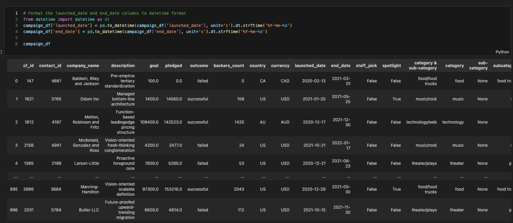
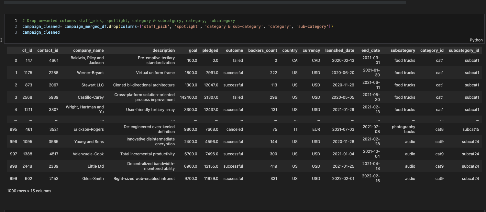
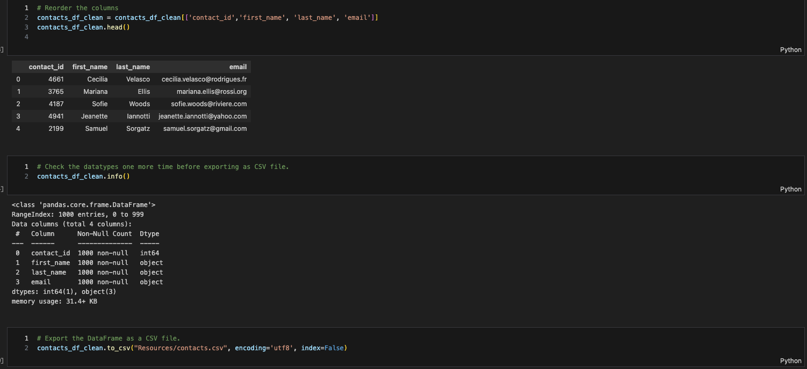

# Crowdfunding_ETL
### Extract, Transform, Load

---
*Purpose: Demonstrate ability to extract, transform, and load data*

---
## Step One: Load Data From Excel File
Use pandas to read in data 

---
## Step Two: Split Columns
Column labelled, "Category & sub-category" needed to be split so we can futher clean and organize data

---
## Step Three: List categories
After more data cleaning, needed to see what categories were extracted from data before cleaning further

---
## Step Four: Clean labels
Column labels were not descriptive enough. Renamed columns for clarity and further cleaning

---
## Step Five: Data Type Conversion
Columns with monetary amounts were converted to "float" type for better data clarity

---
## Step Six: Time Format Cleaning
Columns with Data/Time data were difficult to read. Converted to an easily readable format.

---
## Step Seven: Drop unnecesssary columns
After further review, decided to drop columns that were no longer relevant

---
## Step Eight: Create Dictionaries from Data
Created rows into dictionaries for later data extraction uses

---
## Step Nine: Extract, Clean, and Export Data Snippets
After extracting specific data and further cleaning of said data, exported snippet to new .csv file

